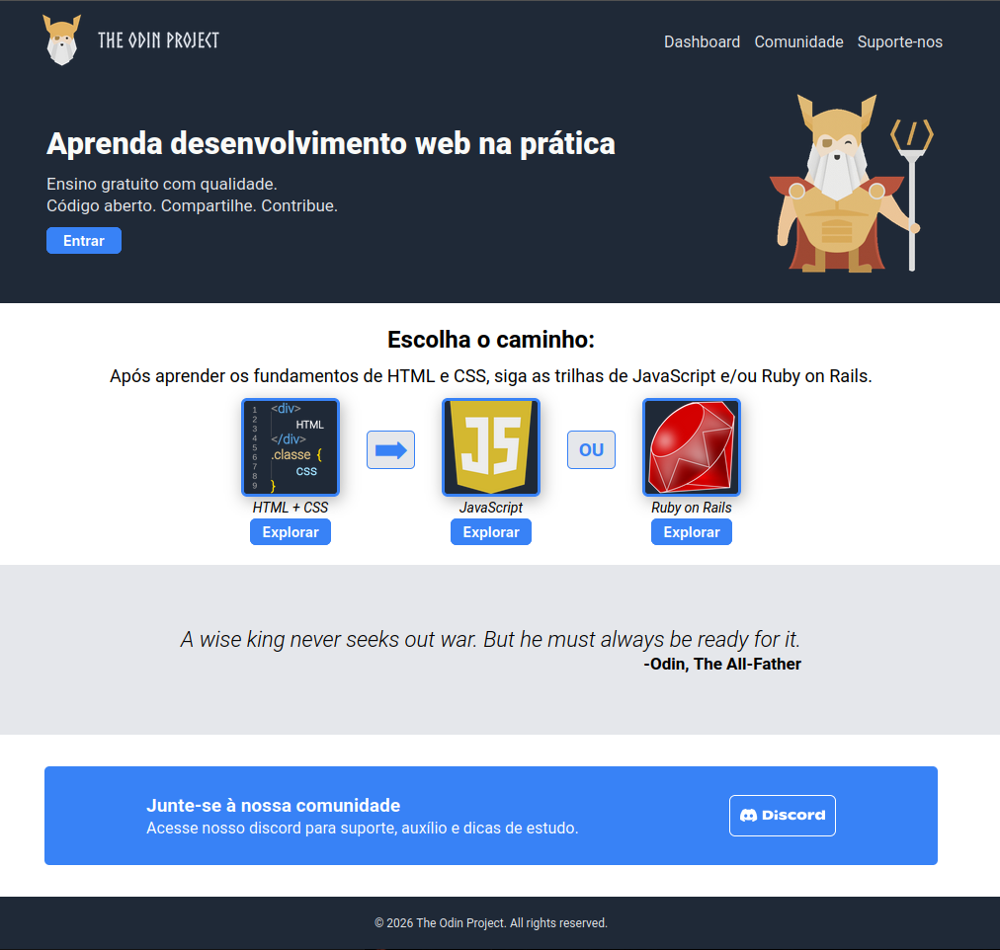

# Landing page - The Odin Project

This is a project done for the foundations course of The Odin Project.
The goal is to practice what I've learned so far in the course, especially using Flexbox.

## Credits for images used

### The Odin Project images:
Images in the header and hero belongs to The Odin Project:
https://www.theodinproject.com

### JavaScript and Ruby images:
Images used in the middle section boxes have public domain license and was published by OpenClipart at:
https://freesvg.org/

OpenClipart:
https://openclipart.org/

### Discord logo image:
The Discord logo used in button at bottom section belongs to Discord:
https://discord.com/branding 

## Landing page expected - Example image:

## Result:
